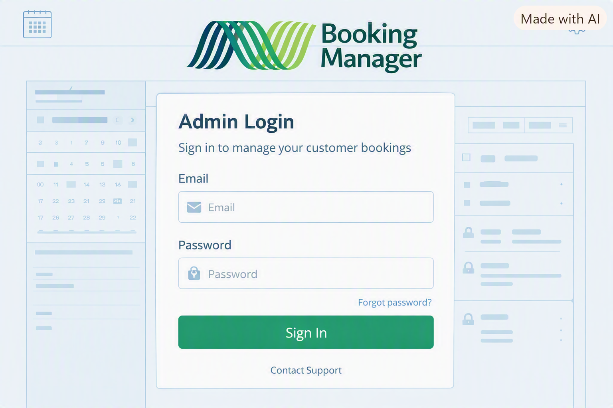

# milestone3

WorkCafe - a website where you can find a good cafe to work from and book a spot, built with Python and Django for my MS3 project.

## Description

WorkCafe helps people find a cafe to sit down and work in - with wifi, power outlets and a quiet corner - and book a spot there.

Anyone can search and view the list of cafes, logged in or not.

Registered users can also:

- register a new cafe
- book a spot at a cafe
- view the cafes on a map

## Purpose

Finding a decent place to work from is hard. Good spots get shared on random group chats or forgotten after one visit, and there is no way to know if there will be room when you get there.

WorkCafe brings this into one simple, searchable list with a map, and lets users book a spot in advance.

## Pages

- `/` - homepage, with search and the current weather
- `/login/` - login page
- `/signup/` - sign up page
- `/map/` - map showing all cafes
- `/add-cafe/` - form to register a new cafe

## Technologies Used

| Technology | Use in WorkCafe |
| --- | --- |
| Python | Runs the backend Django code |
| Django | Routing, templates, authentication, forms and database |
| HTML | Structures the website pages |
| CSS | Controls the appearance and layout |
| Bootstrap | Buttons and layout helpers |
| Bootstrap Icons | Weather icon on the homepage |
| PostgreSQL | The relational database used for the project |
| requests | Calls external APIs from Python (weather) |
| OpenWeatherMap API | Shows the current weather on the homepage |
| Leaflet | Displays the interactive cafe map |
| Esri | Provides the map tiles |
| gunicorn | Runs the Django app in production on Heroku |
| WhiteNoise | Serves the CSS/image files in production |
| dj-database-url | Reads the database connection details Heroku provides |
| Git | Tracks changes made during development |
| GitHub | Stores the project repository and commit history |
| Heroku | Hosts the deployed live site |

## Plan

Full project plan: [MS3.docx](assets/images/document/MS3.docx)

### Who is it for?

Anyone who works remotely or freelances and wants to find a cafe or workspace nearby - students, freelancers, remote workers, people between meetings.

### What problem are they experiencing?

They often struggle with:

- not knowing which nearby cafes are actually good for working (wifi, quiet, power outlets)
- good recommendations getting lost in chats or forgotten
- turning up somewhere with no free space

This wastes time and leads to picking a bad spot.

### Why is a web application an appropriate response?

A web application is ideal because it can:

- be searched from any device before leaving the house
- show cafes on a map
- let anyone add a new place they found
- let a user book a spot ahead of time
- work without needing an account, but reward users who sign up

### What would make the solution valuable enough for someone to use?

The solution becomes valuable when it offers:

- a simple search that actually finds nearby places
- honest, useful details (wifi speed, power outlets, quiet rating)
- a map so a user can see where a cafe actually is
- an easy way to book a spot

### Problems and Solutions

| Problem | WorkCafe Solution |
| --- | --- |
| Good cafes are hard to find | All cafes are searchable in one list and on a map |
| Recommendations get lost in chats | Anyone can register a cafe so it is saved for everyone |
| Turning up to a full cafe | A user can book a spot ahead of time |
| Comparing cafes is hard | Each cafe lists wifi speed, power outlets and a quiet rating |

### Business Goals

- solve a realistic everyday problem
- build a full-stack Django project with a relational database
- demonstrate authentication and CRUD functionality
- keep the interface simple and easy to use
- create a project that is realistic for MS3

## User Stories

### First-time users

- As a new visitor, I want to search cafes without an account, so that I can try the site before signing up.
- As a new visitor, I want to see cafes on a map, so that I know where they actually are.
- As a new user, I want to sign up quickly, so that signing up does not take long.

### Returning users

- As a returning user, I want to log in, so that I can book a spot.
- As a returning user, I want to see the current weather on the homepage, so that I know if I should pick somewhere close by.

### Frequent users

- As a frequent user, I want to register a new cafe, so that other people can find it too.
- As a frequent user, I want to book a spot at a cafe for a specific date and time, so that I know I will have somewhere to sit.
- As a frequent user, I want to cancel a booking I made, so that my schedule stays accurate.

## UX Design (5 Planes)

### 1. Strategy

People need a fast, simple way to find a place to work and know they will have a spot, without having to ask around or guess.

#### Target audience

- students
- freelancers
- remote workers
- anyone between meetings who needs wifi and a seat

#### User needs

- search for a cafe quickly, without needing an account
- see cafes on a map
- sign up and log in easily
- book a spot ahead of time

### 2. Scope

Search cafes (open to everyone), view them on a map, sign up/login, register a new cafe, book a spot.

#### Must have

- search and view the list of cafes, no account needed
- view cafes on a map
- user registration and login
- register a new cafe
- edit or delete a cafe you registered, in case it closed or was entered wrong
- book a spot

#### Should have

- clear error messages on forms
- consistent navigation and branding on every page
- cancel a booking

#### Could have

- current weather shown on the homepage
- save a cafe as a favourite

#### Won't have (this version)

- online payments
- live availability updates

### 3. Structure

Homepage links to login and signup, the map, and lets anyone search. Once logged in, a user can also register a cafe and book a spot.

```text
WorkCafe
|
|-- Home (search, weather)
|-- Map (all cafes marked)
|-- Login
|-- Sign up
|-- Add a cafe
|-- (after login)
    |-- Book a spot
    |-- My bookings
```

### 4. Skeleton

Each page is a centred white card on a light cream background, with a nav bar at the top (logo, Home, Map, Log in, Sign up) and a footer at the bottom, kept consistent across all pages.

Early wireframe (wireframe image generation with Copilot, used for layout reference before building the pages):



### 5. Surface

Coffee-shop colour scheme: warm brown and cream, with the Playfair Display font for headings and Georgia for body text.

## Database Design

The project uses Django's ORM with PostgreSQL as the relational database.

### Database Models

#### Cafe

| Field | Type |
| --- | --- |
| name | CharField |
| address | CharField |
| city | CharField |
| latitude | FloatField |
| longitude | FloatField |
| has_power_outlets | BooleanField |
| wifi_speed_mbps | IntegerField |
| quiet_rating | IntegerField |
| submitted_by | ForeignKey (User) - so only the user who added a cafe can edit or delete it |

#### Spot

| Field | Type |
| --- | --- |
| cafe | ForeignKey (Cafe) |
| spot_name | CharField |
| capacity | IntegerField |

#### Booking

| Field | Type |
| --- | --- |
| user | ForeignKey (User) |
| spot | ForeignKey (Spot) |
| date | DateField |
| start_time | TimeField |
| status | CharField (confirmed, cancelled) |

### Relationships

- one Cafe can have many Spots
- one Spot can have many Bookings
- one User can have many Bookings, but can only view or cancel their own

```text
Cafe ---< Spot ---< Booking >--- User
```

## Validation and Security Planning

- Django already handles login, logout and password saving safely, so I don't write that part myself
- forms use Django's built-in CSRF protection
- only logged-in users can book a spot or register a cafe
- a user can only view or cancel their own bookings, not other users' bookings
- passwords, the database login and the weather API key are never written in the code - they live in an `env.py` file that is not uploaded to GitHub
- DEBUG is off in production so visitors never see error details

## Responsive Design Planning

The layout is built mobile-first with a single centred column, so it naturally works on mobile, tablet and desktop without a separate layout for each size.

## Testing Planning

- manual testing: clicking through search, sign up, login, the map, and (once built) booking/cancelling a spot, checking the result matches what is expected
- `python manage.py check` to catch configuration errors
- HTML and CSS checked with the W3C/Jigsaw validators

### Bugs Found

- `python manage.py check` failed with `SyntaxError: '(' was never closed` in `core/models.py` - a closing bracket was missing on the `Spot.capacity` field. Fix: add the missing `)`.
- On short pages, the footer looked like it was floating in the middle of the screen instead of sitting at the bottom. This was because the CSS that pins the footer to the bottom (`display: flex` on `body` with `margin-top: auto` on the footer) had been removed by mistake. Fix: added it back.
- The homepage weather showed a strange, very high number (like 290 degrees) instead of a normal temperature. The OpenWeatherMap request was missing the `units` parameter, so it returned the temperature in Kelvin instead of Celsius. Fix: added `'units': 'metric'` to the request.
- On the Map page, the Leaflet map box did not show at all - only a thin vertical line appeared where the box should be. The `body` uses `display: flex; flex-direction: column`, which was shrinking the map box down to zero width because it only had a `max-width` and no actual `width`. Fix: added `width: 100%` to the `#cafe-map` rule.
- Seed data for two of the six starter cafes had latitude and longitude swapped, which would have placed them in the wrong spot on the map. Fix: corrected the values in `seed_cafes.py`.
- After deploying to Heroku, the Home link worked but the Map, Login, Sign up and Add a Place links all gave a 404 page. Only the homepage had ever been wired up as a real Django view and template - the other pages were still just static HTML files that Django did not know about. Fix: added a template, view and URL for each page (`/map/`, `/login/`, `/signup/`, `/add-cafe/`).
- The homepage weather icon (loaded as an OpenWeatherMap PNG image) was almost invisible - the icons are light/white and blended into the light cream page background. An emoji was tried next, but emoji look different (and sometimes rough) depending on the visitor's device and browser. Fix: used a Bootstrap Icons icon instead, chosen based on the weather condition, on a light blue circle background so it stands out.
- On the live Heroku site, the map tiles stopped loading and showed a "tile usage policy" warning image instead. The default OpenStreetMap tile server (`tile.openstreetmap.org`) is only meant for light testing, not for a deployed public app. Fix: switched the Leaflet tile layer to Esri's free World Street Map tiles, which do not need an API key and allow this kind of use.

## Deployment

The site is deployed to Heroku, connected to the `main` branch of this GitHub repository so every push automatically redeploys the live site.

### Local setup

1. Clone this repository and create a virtual environment
2. `pip install -r requirements.txt`
3. Create an `env.py` file in the project root (not committed to Git) with `DB_NAME`, `DB_USER`, `DB_PASSWORD`, `DB_HOST`, `DB_PORT` and `WEATHER_API_KEY`
4. `python manage.py migrate`
5. `python manage.py seed_cafes` to add the starter cafes
6. `python manage.py runserver`

### Heroku deployment

1. Create a Heroku app and add the Heroku Postgres add-on
2. Set the Config Vars on Heroku: `SECRET_KEY`, `WEATHER_API_KEY`, `ALLOWED_HOSTS` (the app's Heroku URL) - `DATABASE_URL` is set automatically by the Postgres add-on
3. Connect the app to this GitHub repository and enable automatic deploys from `main`
4. Migrations run automatically on every deploy through the `release` command in the `Procfile`
5. Run `heroku run python manage.py seed_cafes` once, to add the starter cafes to the live database

## Future Improvements

- Saving a cafe as a favourite.
- Showing live availability (how many spots are free right now) using existing booking data.
- Checking in to the cafe you are currently working from, and seeing who else is checked in there right now.
- Deleting your account.

## Changes During Development

| Original Plan | Change | Reason |
| --- | --- | --- |
| The project was going to be "Booking Manager" - a tool for a business owner to manage their own clients and bookings | Changed to "WorkCafe" - a shared, searchable list of cafes anyone can add to and book a spot at | Better matches a project people would actually use, and still needs the same CRUD/auth/database skills |
| The site was going to let users save cafes as favourites but not book them | Added real bookings (Cafe, Spot and Booking models) instead of just favourites | Booking a spot is more useful and gives a fuller set of CRUD features |
| A "Continue as Guest" preview dashboard was planned so visitors could see the app without registering | Removed entirely | Search itself is already open to everyone without an account, so a separate guest preview was not needed |
| Static HTML pages were going to be styled further with more images and effects | Kept deliberately simple | The project is a Django + database CRUD app at its core - time is better spent on that than on extra front-end polish |
| Only the homepage was going to be a real Django page at first, with the other pages as static HTML | Turned Map, Login, Sign up and Add a Place into real Django views, templates and URLs too | Needed so the navigation actually works once deployed, and so forms/pages can be connected to the database later |

## Credits

- Login wireframe image - generated with Copilot
- Logo - designed with Copilot
- business-illustration.gif - Pixabay.com
- coffee.gif - Pixabay.com
- Map tiles - &copy; Esri
