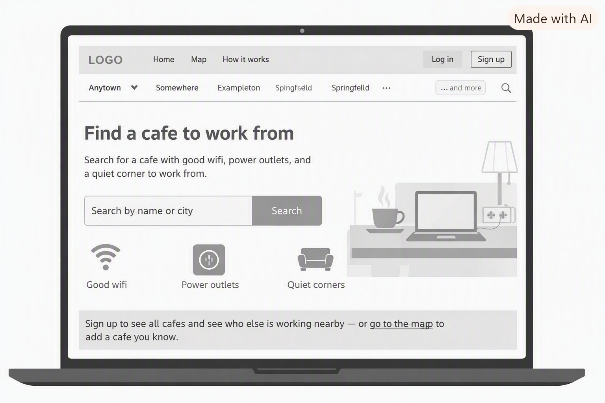

# milestone3

Booking Manager - simple static website for managing clients, bookings and invoices.

## Pages

- index.html - homepage
- login.html - login page
- signup.html - sign up page
- dashboard.html - guest dashboard preview

## Plan

Full project plan: [MS3.docx](assets/images/document/MS3.docx)

### Who is it for?

The application is for small business owners, freelancers, and local service providers - such as hairdressers, personal trainers, cleaners, gardeners, mechanics, and tradespeople - who need a simple, centralised way to manage clients, bookings, and daily business tasks.

### What problem are they experiencing?

They often struggle with:

- keeping track of clients across multiple apps
- forgetting appointments or losing booking details
- creating invoices manually every time
- not having a clear overview of income and expenses
- storing notes, documents, and quotes in scattered places
- spending too much time on admin instead of actual work

This leads to lost revenue, missed opportunities, and unnecessary stress.

### Why is a web application an appropriate response?

A web application is ideal because it can:

- provide centralised access from any device (phone, laptop, tablet)
- manage bookings in real time
- store client information securely
- offer a simple overview of clients and appointments
- update automatically without installing software
- support basic invoicing as a planned future addition

It gives users a single, organised workspace to run their business more efficiently.

### What would make the solution valuable enough for someone to use or pay for?

The solution becomes valuable when it offers:

- reliable appointment scheduling
- easy client management
- a clear overview of upcoming bookings
- a clean, intuitive interface that saves time
- basic invoicing as the feature set grows

People pay for tools that reduce admin work, increase professionalism, and make running a business easier.

## User Stories

- As a new user, I want to sign up for an account, so that I can start managing my business.
- As a returning user, I want to log in, so that I can access my dashboard.
- As a visitor, I want to try the app as a guest, so that I can see what it offers before signing up.
- As a business owner, I want to manage my clients and bookings in one place, so that I save time on admin.

## UX Design (5 Planes)

### 1. Strategy

Business owners need a fast, simple way to manage clients and bookings without juggling multiple apps.

### 2. Scope

Login, signup, a guest-accessible dashboard preview, and basic client/booking management. Invoicing is out of scope for now (see Future Improvements).

### 3. Structure

Homepage links to login and signup, both link back to home and to each other, and a guest can preview the dashboard without an account.

### 4. Skeleton

Each page is a centred white card on a light grey background, with a nav bar at the top and a footer at the bottom, kept consistent across all pages.

Early wireframes (wireframe image generation with Copilot, used for layout reference before building the pages):

### 5. Surface

Green and white colour scheme (matches the logo), Bootstrap buttons, simple sans-serif font.

## Data Schema

Planned models for the full version:

### Client

- name
- email
- phone

### Booking

- title
- date and time
- linked to one client

Each client can have many bookings (one-to-many relationship).

## Future Improvements

- Full invoicing feature (creating, sending and tracking invoices) is planned for a later version and is not part of the current scope.

## Credits

- Dashboard and login wireframe images - generated with Copilot
- manage.gif - Pixabay.com
