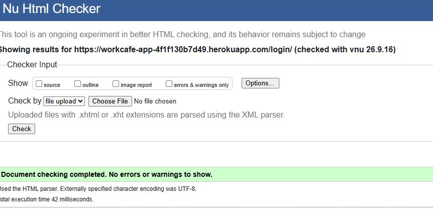
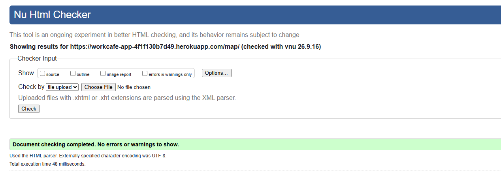
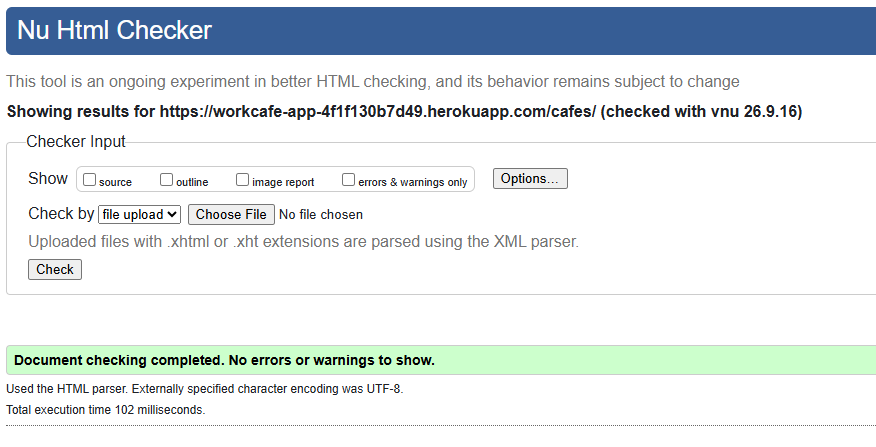
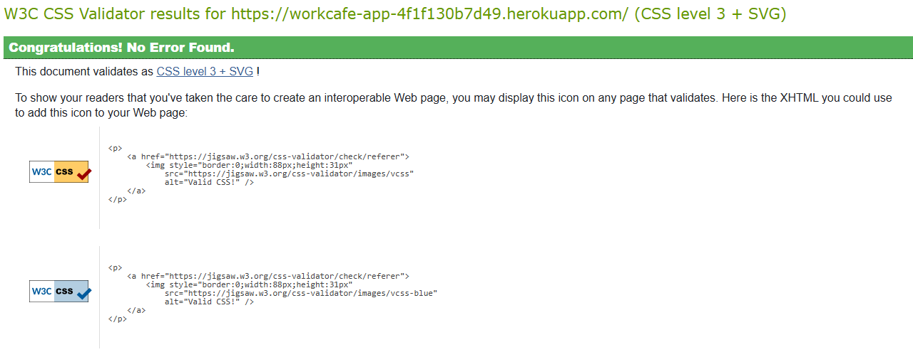
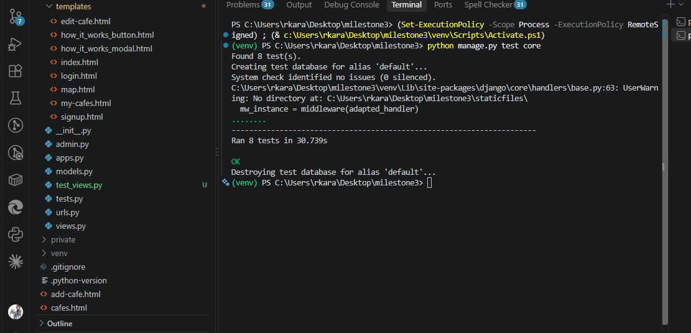
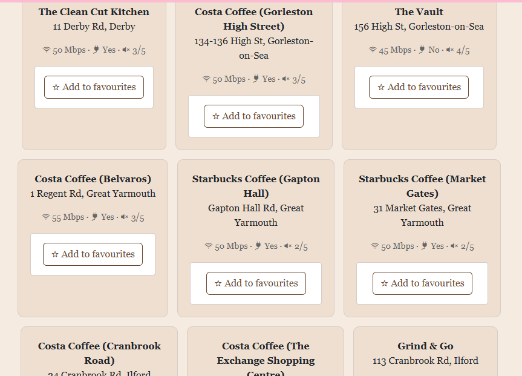
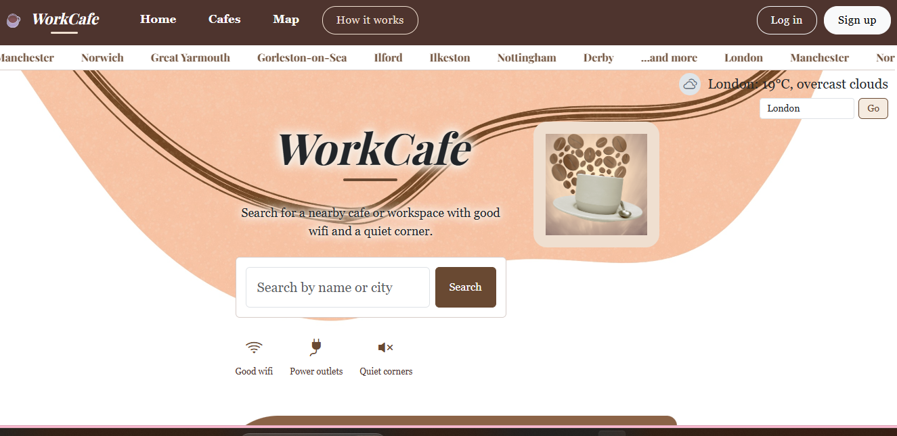

# Testing

## Manual Testing

Tested on a laptop in Microsoft Edge and Mozilla Firefox, and on an iPhone, checking the layout and buttons still work at phone width and that nothing overlaps or falls off the page.

Went through the user stories from the README to check they actually work:

- New visitor: searched for a cafe by name and by city without being logged in, only cafes marked as not members-only showed up, could see the map without an account
- New user: signed up with a username, email and password, picked an avatar, got logged in straight away
- Returning user: logged out and back in with the same account, saw the current weather on the homepage
- Frequent user: registered a new cafe, saw it appear on the map and the cafe list, edited it and deleted it afterwards, marked a cafe as a favourite and saw it under My Cafes

Check-in, checking free space and checking out are not built yet (see Future Improvements), so these could not be tested.

- ran `python manage.py check` to catch configuration errors
- checked HTML and CSS with the W3C/Jigsaw validators









The CSS validator only shows warnings, no errors. Most of the warnings come from Bootstrap's own CSS file (vendor prefixes like `-webkit-` and `-moz-`), not from my code. The only warnings from my own CSS are "same color for background-color and border-color" on a few buttons, which is on purpose so the button has no visible border, just a solid color.

## Automated Testing

Wrote automated tests in `core/test_views.py` using Django's built-in `TestCase`, run with `python manage.py test core`.

- homepage loads for anyone
- signing up creates a new user and logs them in
- logging in with the wrong password shows an error message instead of crashing
- a logged out user trying to add a cafe gets sent to the login page
- a logged in user can add a new cafe
- a user cannot edit a cafe they don't own (gets a 404, not someone else's data)
- favouriting a cafe adds it, favouriting it again removes it
- deleting a cafe actually removes it from the database



## Bugs Found

| Bug | Fix |
| --- | --- |
| Missing closing bracket on `Spot.capacity` in `core/models.py` caused a SyntaxError | Added the missing `)` |
| Footer floated in the middle of short pages instead of sitting at the bottom - the flex CSS that pins it down had been removed by mistake | Added the flex CSS back |
| Weather showed a strange number like 290 degrees - the API request was missing `units: metric`, so it returned Kelvin | Added the units parameter |
| The map box didn't show, just a thin line - it only had `max-width` set, no `width`, so the flex layout shrank it to nothing | Added `width: 100%` |
| Two of the seed cafes had latitude and longitude swapped, putting them in the wrong spot | Corrected the values in `seed_cafes.py` |
| On Heroku, the Map/Login/Sign up/Add a Place links gave a 404 - only the homepage had a real Django view and template | Added a view, template and URL for each page |
| The weather icon (an OpenWeatherMap image) was almost invisible on the light background, and an emoji looked different on every device | Used a Bootstrap Icons icon instead, on a light blue circle so it stands out |
| On the live site, the map tiles stopped loading and showed a usage policy warning - `tile.openstreetmap.org` isn't meant for a deployed public app | Switched to Esri's free tiles, no key needed |
| Missing closing bracket on `request.GET.get('city', 'London'` in `core/views.py` caused a SyntaxError, so the homepage would not load | Added the missing `)` |
| The Add a Place page showed the sign up form instead of the add cafe form - the view was rendering the wrong template | Fixed `add_cafe_page` to render `add-cafe.html` |
| Sign up is completely broken - the whole site fails to load with a `SyntaxError: '(' was never closed` in `core/views.py`, on the `User.objects.create_user(...)` line in `signup_page` | Added the missing `)` |
| The sign up error message says "Passwords do match" when the two passwords are different - the word "not" is missing, so the message means the opposite of what it should | Added the missing word, back to "Passwords do not match" |
| A couple of typos in the seed command messages ("databse" and "alredy exists") | Fixed the spelling |
| Editing a cafe was broken - the whole site failed to load because of another missing closing bracket in `core/views.py` | Added the missing `)` |
| The search box on the map page didn't do anything when submitted - the form had no `method` or field `name`, so it wasn't sending the search anywhere | Wired it up like the homepage search, so it filters the map pins by name or city |
| Typo in `core/admin.py` - `list_filter` used `member_only` instead of `members_only`, so the admin site would not load (`admin.E116`) | Fixed the field name to `members_only` |
| The homepage crashed with a 500 error, both locally and on the live site - `index.html` used `` in its content block but was missing `` at the top, since that tag has to be loaded again in every file that extends `base.html` and uses it | Added `` back to `index.html` |
| The sign up page avatars did not load, just broken image icons - the Multiavatar website blocked the requests | Made the avatar pictures with the Multiavatar package instead and saved them as normal image files in the project, so there is no live website needed anymore |
| Adding a new cafe did not give any feedback - after saving, the page just showed the same empty form again instead of going to the map, because `add_cafe_page` was missing a `return redirect('map')` after saving | Added the missing redirect |
| The cafe list showed 9 cafes before pressing "More" instead of 10 - `cafe-list.html` used `forloop.counter >= 10` instead of `> 10`, so the 10th cafe got hidden too | Changed it to `> 10` |
| After adding a background picture to the homepage, the weather text ("London: 19°C...") was hard to read because the patterned background showed through it | Added a text-shadow so the text always stays readable |






## Security Check

Ran Django's built-in deployment check to see if any recommended production security settings were missing:

```bash
python manage.py check --deploy
```

This came back with these warnings, since none of the settings below existed yet in `config/settings.py`:

```text
WARNINGS:
?: (security.W004) You have not set a value for the SECURE_HSTS_SECONDS setting. If your entire site is served only over SSL, you may want to consider setting a value and enabling HTTP Strict Transport Security. Be sure to read the documentation first; enabling HSTS carelessly can cause serious, irreversible problems.
?: (security.W008) Your SECURE_SSL_REDIRECT setting is not set to True. Unless your site should be available over both SSL and non-SSL connections, you may want to either set this setting True or configure a load balancer or reverse-proxy server to redirect all connections to HTTPS.
?: (security.W012) SESSION_COOKIE_SECURE is not set to True. Using a secure-only session cookie makes it more difficult for network traffic sniffers to hijack user sessions.
?: (security.W016) You have 'django.middleware.csrf.CsrfViewMiddleware' in your MIDDLEWARE, but you have not set CSRF_COOKIE_SECURE to True. Using a secure-only CSRF cookie makes it more difficult for network traffic sniffers to steal the CSRF token.
?: (security.W018) You should not have DEBUG set to True in deployment.
```

Added the missing settings, only turned on when `DEBUG` is off (production):

```python
if not DEBUG:
    SECURE_SSL_REDIRECT = True
    SESSION_COOKIE_SECURE = True
    CSRF_COOKIE_SECURE = True
    SECURE_HSTS_SECONDS = 3600
    SECURE_HSTS_INCLUDE_SUBDOMAINS = True
    SECURE_HSTS_PRELOAD = True
    SECURE_CONTENT_TYPE_NOSNIFF = True
    SECURE_PROXY_SSL_HEADER = ('HTTP_X_FORWARDED_PROTO', 'https')
```

Also added `CSRF_TRUSTED_ORIGINS`, built automatically from `ALLOWED_HOSTS`.

Re-ran the check with `DEBUG=False` (simulating production) and all of these warnings were gone. Running the check normally, with `DEBUG=True` for local development, still shows these warnings - that is expected, since the settings above are only meant to apply once deployed, not on a local machine.
