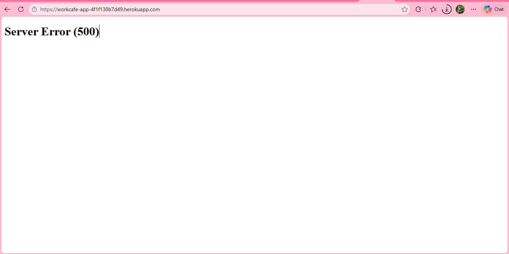
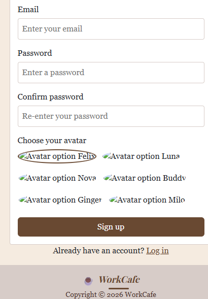

# Testing

## Manual Testing

- clicked through search, sign up, login, the map, and (once built) booking/cancelling a spot, checking the result matches what is expected
- ran `python manage.py check` to catch configuration errors
- checked HTML and CSS with the W3C/Jigsaw validators

## Bugs Found

| Bug | Fix |
| --- | --- |
| Missing closing bracket on `Spot.capacity` in `core/models.py` caused a SyntaxError | Added the missing `)` |
| Footer floated in the middle of short pages instead of sitting at the bottom - the flex CSS that pins it down had been removed by mistake | Added the flex CSS back |
| Weather showed a strange number like 290 degrees - the API request was missing `units: metric`, so it returned Kelvin | Added the units parameter |
| The map box didn't show, just a thin line - it only had `max-width` set, no `width`, so the flex layout shrank it to nothing | Added `width: 100%` |
| Two of the seed cafes had latitude and longitude swapped, putting them in the wrong spot | Corrected the values in `seed_cafes.py` |
| On Heroku, the Map/Login/Sign up/Add a Place links gave a 404 - only the homepage had a real Django view and template | Added a view, template and URL for each page |
| The weather icon (an OpenWeatherMap image) was almost invisible on the light background, and an emoji looked different on every device | Used a Bootstrap Icons icon instead, on a light blue circle so it stands out |
| On the live site, the map tiles stopped loading and showed a usage policy warning - `tile.openstreetmap.org` isn't meant for a deployed public app | Switched to Esri's free tiles, no key needed |
| Missing closing bracket on `request.GET.get('city', 'London'` in `core/views.py` caused a SyntaxError, so the homepage would not load | Added the missing `)` |
| The Add a Place page showed the sign up form instead of the add cafe form - the view was rendering the wrong template | Fixed `add_cafe_page` to render `add-cafe.html` |
| Sign up is completely broken - the whole site fails to load with a `SyntaxError: '(' was never closed` in `core/views.py`, on the `User.objects.create_user(...)` line in `signup_page` | Added the missing `)` |
| The sign up error message says "Passwords do match" when the two passwords are different - the word "not" is missing, so the message means the opposite of what it should | Added the missing word, back to "Passwords do not match" |
| A couple of typos in the seed command messages ("databse" and "alredy exists") | Fixed the spelling |
| Editing a cafe was broken - the whole site failed to load because of another missing closing bracket in `core/views.py` | Added the missing `)` |
| The search box on the map page didn't do anything when submitted - the form had no `method` or field `name`, so it wasn't sending the search anywhere | Wired it up like the homepage search, so it filters the map pins by name or city |
| Typo in `core/admin.py` - `list_filter` used `member_only` instead of `members_only`, so the admin site would not load (`admin.E116`) | Fixed the field name to `members_only` |
| The homepage crashed with a 500 error, both locally and on the live site - `index.html` used `` in its content block but was missing `` at the top, since that tag has to be loaded again in every file that extends `base.html` and uses it | Added `` back to `index.html` |
| The sign up page avatars did not load, just broken image icons - the Multiavatar website blocked the requests | Made the avatar pictures with the Multiavatar package instead and saved them as normal image files in the project, so there is no live website needed anymore |

